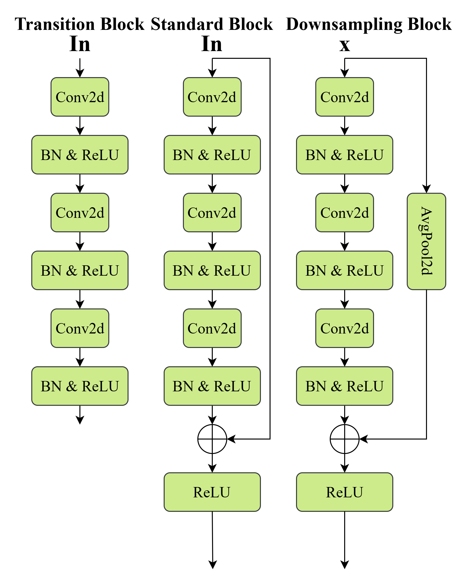
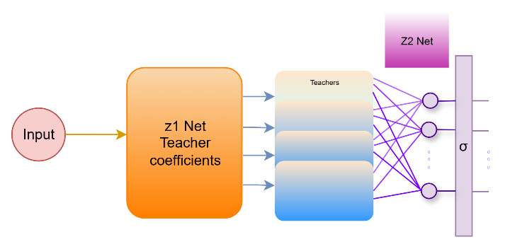
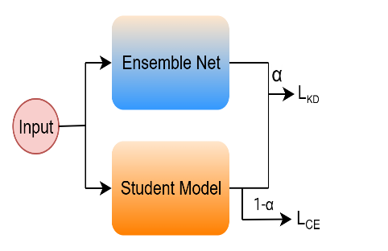
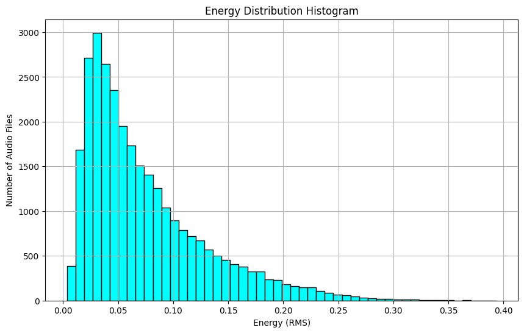

# EchoFuse

Lightweight acoustic scene classification for edge deployment using a compact student network, learned teacher fusion, knowledge distillation, and device-aware training.

The deployed model contains approximately **60K parameters** and requires about **30M MACs** per inference. Under matched lightweight evaluation conditions, it reaches **state-of-the-art performance** on TAU Urban Acoustic Scenes 2022 Mobile.

## Key Results

| Evaluation Setup | Accuracy | Parameters | MACs |
|---|---:|---:|---:|
| **TAU-UAS 2022 Mobile — 25% training split** | **59.9%** | **60K** | **30M** |
| **Device-aware TAU evaluation** | **60.6%** | **60K** | **30M** |
| **Best learned teacher fusion** | **64.3%** | Training-time ensemble | — |

The compact student reaches **59.9% accuracy** when trained using the same 25% TAU split used for the lightweight comparison.

With device-aware specialization, the system reaches **60.6% accuracy** while retaining the same **60K-parameter, 30M-MAC** student configuration.

---

## Highlights

- **~60K parameters** in the deployed student
- **~30M MACs** per inference
- **59.9% accuracy** on the matched 25% TAU training split
- **60.6% accuracy** with device-aware evaluation
- **64.3% accuracy** from the strongest learned teacher-fusion configuration
- State-of-the-art performance under lightweight edge-oriented constraints
- Quantization-ready compact CNN backbone
- Depthwise-separable expand–depthwise–project blocks
- Global Response Normalization
- Heterogeneous multi-teacher supervision
- Sample-adaptive teacher weighting
- Per-class learned logit fusion
- Temperature-scaled knowledge distillation
- Dynamic impulse-response augmentation
- Device-aware training and inference
- No teacher ensemble required during final student inference

---

# Overview

The main objective is simple:

> Make training powerful while keeping inference compact.

The training system uses multiple complementary teacher models and learned fusion mechanisms to produce richer supervisory targets. That knowledge is transferred into a single lightweight student using temperature-scaled knowledge distillation.

The final deployment model is only the compact student.

The overall strategy is:

1. build a small edge-oriented student,
2. train a diverse teacher pool,
3. learn adaptive teacher-fusion functions,
4. form a strong ensemble target,
5. distill the ensemble into the student,
6. improve device robustness with adaptive impulse-response augmentation.

---

# Architecture

The deployed network is a compact, quantization-ready convolutional model based on stacked depthwise-separable **expand–depthwise–project** blocks.

The backbone is organized into three successive stages with modest width growth and selective downsampling. Lightweight residual connections are used where tensor shapes are compatible.

A Global Response Normalization module follows the compact blocks to stabilize optimization and improve tolerance to device and noise variation.

The final feature map is reduced with global average pooling and mapped directly to acoustic-scene logits.

## Student Architecture



The compact student includes:

- depthwise-separable convolutions
- expand–depthwise–project blocks
- lightweight residual connections
- selective downsampling
- Global Response Normalization
- global average pooling
- a linear classification head
- quantization-friendly operations
- operator-fusion-compatible convolution sequences

The deployed configuration requires approximately:

| Property | Value |
|---|---:|
| Parameters | **~60K** |
| MACs | **~30M** |
| Target classes | **10** |

The architecture is designed to preserve useful representation capacity while remaining suitable for mobile and embedded inference.

---

# Compact Building Blocks

The student uses three related block behaviors.

## Transition Block

Transition blocks change the representation between network stages.

## Standard Block

Standard blocks preserve compatible tensor shapes and use a lightweight residual connection.

## Downsampling Block

Downsampling blocks reduce spatial resolution while retaining an efficient residual-style path.

Together, these blocks control the tradeoff between:

- receptive field
- model size
- arithmetic cost
- optimization stability
- deployment efficiency

---

# Teacher Ensemble

The training system uses a heterogeneous pool of **eight teacher models**.

Five teachers are higher-capacity variants structurally related to the compact student, while the remaining teachers provide complementary architectural behavior.

The goal is not to deploy these models together. Their role is to create a stronger supervisory signal during training.

## Teacher-Ensemble Architecture



Two complementary fusion mechanisms are learned:

- **z1** — sample-adaptive teacher weighting
- **z2** — per-class logit fusion

These learned fusion functions provide a stronger alternative to relying only on static averaging.

---

# z1 — Sample-Adaptive Teacher Fusion

The z1 network uses the same general backbone design as the compact student but replaces the final classifier with an output containing one score for each teacher.

For $K$ teachers, z1 produces:

$$\mathbf{a}(x) = \mathrm{softmax}\left(\mathbf{g}(x)\right)$$

where:

- $\mathbf{g}(x)$ contains one raw score for each teacher
- $\mathbf{a}(x)$ contains normalized mixture coefficients
- $a_k(x)$ is the weight assigned to teacher $k$

The fused teacher logits are:

$$\mathbf{t}_{z1}(x) = \sum_{k=1}^{K}a_k(x)\mathbf{t}_k(x)$$

Each input can therefore assign a different importance to each teacher.

This makes z1 a **sample-dependent fusion mechanism** rather than a fixed averaging strategy.

---

# z2 — Per-Class Logit Fusion

The z2 mechanism operates directly on the teacher outputs.

For every target class, the corresponding logits from all teachers are collected and passed through a lightweight learned mapping.

For class $c$:

$$t_{z2}^{(c)}(x) = f_c\left(t_1^{(c)}(x),t_2^{(c)}(x),\ldots,t_K^{(c)}(x)\right)$$

The class-specific outputs are then concatenated:

$$\mathbf{t}_{z2}(x) = \left[t_{z2}^{(1)}(x),\ldots,t_{z2}^{(C)}(x)\right]$$

Unlike z1, this mechanism is not restricted to convex teacher weighting.

It can learn different teacher relationships for different acoustic-scene classes.

---

# Teacher Fusion Results

Let **a1** denote the average of the teacher logits.

| Ensemble Output | Accuracy |
|---|---:|
| a1 | 63.4% |
| z1 | 64.1% |
| z2 | 60.1% |
| **a1 + z1** | **64.3%** |
| a1 + z2 | 61.1% |
| z1 + z2 | 60.9% |
| a1 + z1 + z2 | 62.4% |

The strongest observed fusion is the combination of **teacher averaging and z1**, reaching **64.3% accuracy**.

This combination is therefore used as the primary ensemble signal for student training.

---

# Knowledge Distillation

The teacher ensemble is used to transfer its decision behavior into the lightweight student.

## Distillation Pipeline



For an input $x$, let:

- $\mathbf{t}_{ens}(x)$ denote the ensemble teacher logits
- $\mathbf{z}(x)$ denote the student logits
- $T$ denote the distillation temperature
- $y$ denote the ground-truth class
- $C$ denote the number of classes

---

# Softened Teacher and Student Distributions

The temperature-scaled teacher distribution is:

$$q_T(x) = \mathrm{softmax}\left(\frac{\mathbf{t}_{ens}(x)}{T}\right)$$

The corresponding student distribution is:

$$p_T(x) = \mathrm{softmax}\left(\frac{\mathbf{z}(x)}{T}\right)$$

Temperature scaling softens the output distributions and exposes relationships between classes that are not visible in one-hot labels alone.

---

# Ground-Truth Classification Loss

The student remains directly supervised by the correct acoustic-scene label:

$$\mathcal{L}_{\mathrm{CE}}(x,y) = -\log\left(\mathrm{softmax}(\mathbf{z}(x))_y\right)$$

This term keeps optimization anchored to the ground-truth targets.

---

# Distillation Loss

The student is encouraged to reproduce the softened ensemble distribution using Kullback–Leibler divergence:

$$\mathcal{L}_{\mathrm{KD}}(x) = T^2\mathcal{L}_{\mathrm{KL}}\left(q_T(x)\,\|\,p_T(x)\right)$$

The class-wise form is:

$$\mathcal{L}_{\mathrm{KD}}(x) = T^2\sum_{c=1}^{C}q_T^{(c)}(x)\left[\log q_T^{(c)}(x)-\log p_T^{(c)}(x)\right]$$

The factor $T^2$ preserves useful gradient magnitudes across different temperatures.

---

# Complete Student Objective

The final training objective combines direct label supervision with ensemble knowledge:

$$\mathcal{L}(x,y) = (1-\alpha)\mathcal{L}_{\mathrm{CE}}(x,y) + \alpha\mathcal{L}_{\mathrm{KD}}(x)$$

where:

$$\alpha \in [0,1]$$

The parameter $\alpha$ determines the balance between ground-truth supervision and distilled teacher supervision.

| $\alpha$ | Behavior |
|---:|---|
| $0$ | Ground-truth supervision only |
| $0 < \alpha < 1$ | Combined label and ensemble supervision |
| $1$ | Distillation supervision only |

Only the student receives gradients from the final distillation objective.

---

# Datasets and Training Strategy

The main evaluation benchmark is **TAU Urban Acoustic Scenes 2022 Mobile**, which contains one-second recordings across 10 urban acoustic scenes and multiple recording devices.

The broader training strategy also uses additional acoustic datasets for pretraining and representation learning before adaptation to the main task.

| Dataset | Role |
|---|---|
| **TAU Urban Acoustic Scenes 2022 Mobile** | Main training and evaluation benchmark |
| **CochlScene** | Acoustic-scene pretraining |
| **AudioSet** | Broad acoustic representation pretraining |
| **ESC-50** | Environmental-audio pretraining and auxiliary validation |
| **ICME ASC 2024 data** | Domain-shift experimentation |

The combination of broad pretraining and target-domain adaptation is intended to improve generalization under heterogeneous recording conditions.

---

# Training Configuration

| Setting | Value |
|---|---:|
| Optimizer | Adam |
| Learning rate | $1\times10^{-4}$ |
| Batch size | 64 |
| Epochs | 80 |
| Teacher models | 8 |
| Student parameters | ~60K |
| Student MACs | ~30M |

Training combines:

- hard-label supervision
- learned teacher fusion
- temperature-scaled distillation
- device-aware augmentation
- target-domain fine-tuning

---

# Device-Robust Augmentation

A major challenge in acoustic scene classification is **device mismatch**.

The same acoustic environment can produce noticeably different spectral characteristics when captured by different microphones, smartphones, or embedded sensors.

Impulse-response augmentation is therefore used to generate device-shifted signal variants during training.

## Adaptive IR Augmentation



The augmentation strength is dynamically modulated according to the energy characteristics of each input signal.

Higher-energy signals receive proportionally stronger augmentation, while lower-energy signals receive lighter transformations.

This strategy is designed to:

- simulate heterogeneous recording devices
- diversify the effective training distribution
- reduce overfitting to device-specific signatures
- improve generalization to mismatched devices
- preserve transformations that remain consistent with the underlying signal

---

# Evaluation Using 25% of the TAU Training Data

A controlled comparison is performed using only **25% of the TAU training split**.

The same data fraction is used throughout the comparison.

| Configuration | Accuracy | Parameters | MACs |
|---|---:|---:|---:|
| Reference A | 59.7% | 100K | **16M** |
| Reference B | 59.1% | 60K | 30M |
| Reference C | 58.4% | 60K | 26M |
| Reference D | 58.0% | 120K | **16M** |
| **EchoFuse** | **59.9%** | **60K** | 30M |

EchoFuse achieves the highest accuracy in this matched comparison.

Relative to the strongest comparison result:

- accuracy increases from **59.7% to 59.9%**
- parameters decrease from **100K to 60K**
- the student remains within an edge-oriented compute budget

This demonstrates that the improvement does not require a large deployment model.

---

# Device-Aware Evaluation

The second evaluation explicitly uses recording-device information.

The training set contains **six distinct devices**. Device-specific student and ensemble models are trained for known devices, while a global model trained using all available devices is used for samples from unseen devices.

At inference time:

- samples from recognized devices use the corresponding specialized model
- samples from unseen devices use the global model

The resulting comparison is:

| Configuration | Accuracy | Parameters | MACs |
|---|---:|---:|---:|
| Reference A | 60.5% | 60K | 30M |
| Reference B | 60.4% | 116K | **10M** |
| Reference C | 59.3% | 60K | 17M |
| Reference D | 59.0% | 60K | 28M |
| **EchoFuse** | **60.6%** | **60K** | 30M |

EchoFuse reaches **60.6% accuracy**, the highest value in the reported comparison.

The result is obtained with the same compact **60K-parameter** student scale.

---

# Accuracy vs. Deployment Cost

The training-time teacher fusion reaches:

$$64.3\%$$

The final lightweight system reaches:

$$60.6\%$$

with approximately:

$$60\mathrm{K}\text{ parameters}$$

and:

$$30\mathrm{M}\text{ MACs}$$

The ensemble is used as a high-quality supervisory source during training rather than as a permanent inference requirement.

This separation allows the system to benefit from model diversity while keeping deployment cost controlled.

---

# Why It Works

The final performance comes from several complementary design choices.

## Efficient Student Backbone

Depthwise-separable processing keeps the parameter count and computational cost low while retaining useful feature capacity.

## Global Response Normalization

GRN stabilizes compact-model training and improves robustness to noise and device variability.

## Diverse Teacher Knowledge

The teacher pool provides complementary decision boundaries and acoustic representations.

## Sample-Adaptive Fusion

z1 learns which teacher outputs should receive more weight for each individual input.

## Per-Class Fusion

z2 learns class-specific combinations of teacher predictions.

## Stable + Adaptive Ensemble Target

Combining teacher averaging with z1 produces the strongest observed fusion result of **64.3%**.

## Temperature-Scaled Knowledge Transfer

Softened teacher distributions provide information about relationships between acoustic-scene classes that hard labels cannot represent.

## Device-Aware Augmentation

Adaptive impulse-response transformations reduce dependence on the characteristics of individual recording devices.

## Lightweight Final Inference

The high-capacity teacher system is required only during training. The deployed model remains the compact student.

---

# Deployment Characteristics

EchoFuse is designed around edge constraints from the beginning.

The final student provides:

- approximately **60K parameters**
- approximately **30M MACs**
- depthwise-separable convolution
- global-pooling-based classification
- hardware-friendly channel organization
- quantization-ready operations
- operator-fusion compatibility
- no training-time ensemble dependency during normal inference

Potential deployment environments include:

- mobile acoustic intelligence
- embedded sensing
- context-aware systems
- low-memory audio processing
- environmental monitoring
- always-on acoustic analysis
- resource-constrained edge hardware

---

# Final Summary

EchoFuse combines:

- a compact depthwise-separable student
- Global Response Normalization
- eight heterogeneous teacher models
- sample-adaptive z1 fusion
- per-class z2 fusion
- temperature-scaled knowledge distillation
- broad acoustic pretraining
- dynamic impulse-response augmentation
- device-aware specialization

The primary results are:

| Setup | Accuracy | Parameters | MACs |
|---|---:|---:|---:|
| **25% TAU training split** | **59.9%** | **60K** | **30M** |
| **Device-aware evaluation** | **60.6%** | **60K** | **30M** |
| **Best teacher fusion** | **64.3%** | Training only | — |

The result is a lightweight acoustic-scene classification system that achieves **state-of-the-art performance under edge-oriented constraints** while keeping the deployed model at approximately **60K parameters** and **30M MACs**.

---
# Code Structure

The repository is organized into modular components for the compact student, teacher ensemble, learned fusion, knowledge distillation, augmentation, training, and evaluation.

```text
EchoFuse/
├── echofuse/
│   ├── models/
│   │   ├── student.py              # Compact CP-Mobile student
│   │   ├── fusion.py               # z1 and z2 fusion networks
│   │   ├── ensemble.py             # Teacher-ensemble aggregation
│   │   ├── device_router.py        # Device-aware model routing
│   │   └── teachers/               # Teacher architectures
│   ├── distillation/
│   │   ├── logits.py               # Temperature-scaled distributions
│   │   └── objective.py            # KD objective
│   ├── training/
│   │   ├── fusion.py               # Fusion-network training
│   │   ├── kd.py                   # Student distillation
│   │   ├── engine.py               # Shared training utilities
│   │   └── pipeline.py             # End-to-end training pipeline
│   ├── evaluation/                 # Testing, metrics, and deployment utilities
│   ├── augmentations.py            # Device-robust audio augmentation
│   ├── spectrum.py                 # Audio feature processing
│   ├── checkpoints/                # TAU checkpoints
│   └── config.py                   # Shared configuration
│
├── scripts/
│   ├── train_fusion.py             # Train z1/z2 ensemble fusion
│   ├── train_kd.py                 # Distill the ensemble into the student
│   └── evaluate_student.py         # Evaluate the final compact model
│
└── docs/                            # Additional model and training documentation
```

The package separates **teacher construction, learned ensemble fusion, student distillation, and final evaluation** so that each stage can be inspected or modified independently while keeping the deployment model lightweight.

